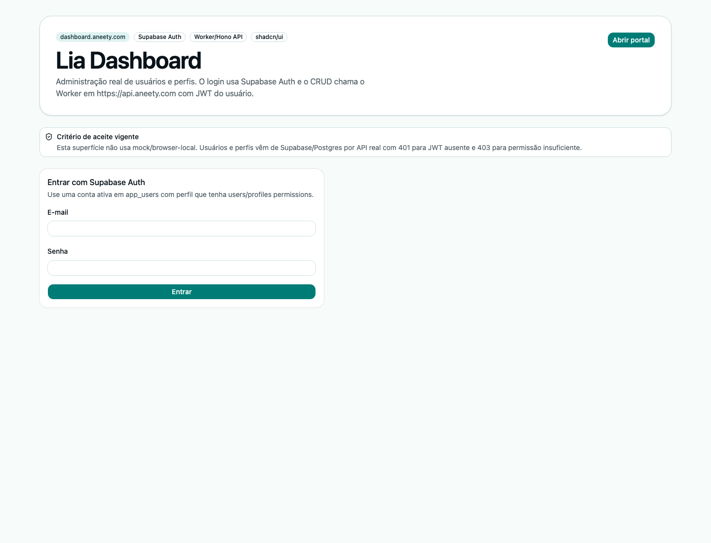

# lia-dashboard

Administrativo para consultórios, clínicas e bureau, incluindo CRUD usuários/perfis.

## URL pública alvo

https://dashboard.aneety.com/

## Arquitetura alvo

- Cloudflare Pages Free para assets estáticos gerados por Vite em `dist`.
- Supabase Auth para login.
- API Cloudflare Workers + Hono via `VITE_API_URL=https://api.aneety.com`.
- Contratos compartilhados por `lia-core` em <https://core.aneety.com/>.
- Base real Supabase/Postgres; não usar mock como destino final.
- Custo zero: sem Pages Functions pagas, Workers Paid, Containers ou add-ons.

## Fluxo principal

- Login Supabase Auth com `@supabase/supabase-js`.
- CRUD de usuários e perfis de acesso via `https://api.aneety.com/api/users` e `/api/access-profiles`.
- Associação usuário, perfil e tenant retornada pelo Worker conforme JWT Supabase.
- Status ativo/inativo de usuário e permissões do perfil editáveis pela API real.
- Configuração white-label e métricas por tenant seguem como próxima etapa.

## Status

Dashboard React/Vite com shadcn/ui e integração inicial real com Supabase Auth + Worker/Hono. A tela não usa dados mock; quando não há sessão ou permissão, mostra erro real da API (`401`/`403`).

## Screenshot



## Deploy Cloudflare Pages Free

```bash
pnpm lint
pnpm test
pnpm build
pnpm deploy:cloudflare
```

Projeto Cloudflare Pages esperado: `lia-dashboard`, com deploy do diretório `dist`.

Variáveis públicas de build esperadas no GitHub/Cloudflare Pages:

- `VITE_API_URL=https://api.aneety.com`
- `VITE_SUPABASE_URL`
- `VITE_SUPABASE_PUBLISHABLE_KEY`

Não configurar `SUPABASE_SERVICE_ROLE_KEY` em frontend/Pages; ela permanece somente no Worker `lia-backend`.

## Design system

- React + Vite + TypeScript + Tailwind + shadcn/ui.
- `components.json` versionado no repo.
- Componentes copiados para `src/components/ui` via `pnpm dlx shadcn@latest add`.
- Aliases `@/*`, `@/components`, `@/components/ui`, `@/lib` configurados para o app.
